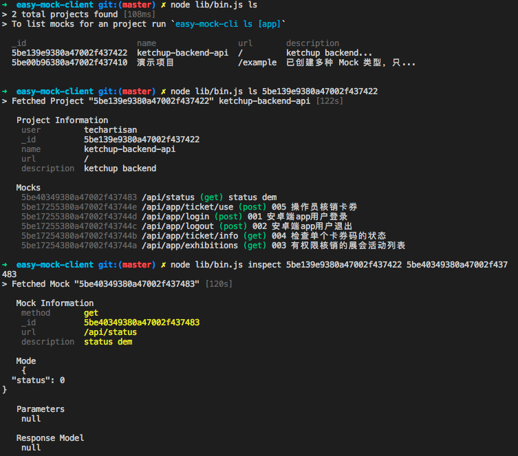

# EASY MOCK CLIENT
[![Build Status][travis-image]][travis-url]
[![codecov][codecov-image]][codecov-url]
[![NPM version][npm-image]][npm-url]

> 开发一个可以在命令行下使用[easy mock](https://github.com/easy-mock/easy-mock)的工具

## 使用说明：

### 客户端使用

`npm install -g easy-mock-client`

首先在执行脚本的目录下创建配置文件`app.json`，配置格式如下：
```json
{
  "easy-mock": {
    "host": "http://mock.liuwill.com",
    "name": "username",
    "password": "password"
  }
}
```
分别设置easy mock服务器的主机地址，用户名和密码。

查看帮助：
`$ easy-mock-client help`

执行命令：

```shell
# 列出所有project
$ node ./lib/bin ls
# 或者
$ easy-mock-client ls

# 获取单个project的信息和project下的所有mock接口
$ node ./lib/bin ls YourProjectId
# 或者
$ easy-mock-client ls YourProjectId

# 查看某个project下的单个mock详细信息
$ node ./lib/bin inspect YourProjectId YourMockId
# 或者
$ easy-mock-client inspect YourProjectId YourMockId

# 创建一个mock接口
$ node ./lib/bin create mock
# 或者
$ easy-mock-client create mock
```

### SDK使用：

```
yarn add easy-mock-client
```

直接在代码中调用api，代码可以参看命令行实现或者单元测试。

```javascript
import EasyMockClient from 'easy-mock-client'

async function main() {
  const client = new EasyMockClient({
    "host": "http://mock.liuwill.com",
    "name": "username",
    "password": "password" 
  })
  client.connect().then(responseData => {
    console.log('登录Easy Mock成功')
  })

  const myProjects = await client.listProjects()
  console.log(myProjects)
}
main().catch(err => {
    process.exit(1)
})
```

### 效果



## License

  [MIT](./LICENSE)

[travis-image]: https://img.shields.io/travis/easy-tools/easy-mock-client/master.svg?style=flat-square
[travis-url]: https://travis-ci.org/easy-tools/easy-mock-client
[codecov-image]: https://img.shields.io/codecov/c/github/codecov/example-python.svg?style=flat-square
[codecov-url]: https://codecov.io/gh/easy-tools/easy-mock-client
[npm-image]: https://img.shields.io/npm/v/easy-mock-client.svg?style=flat-square
[npm-url]: https://npmjs.org/package/easy-mock-client
